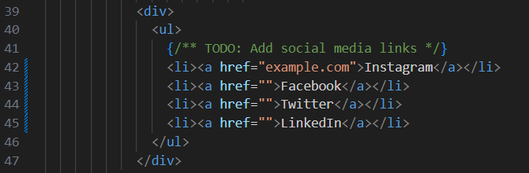
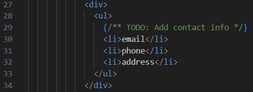

# Adding further content

Created by: Rodrigo Kalvans
Created time: June 5, 2023 5:17 PM
Last edited by: Rodrigo Kalvans
Last edited time: June 5, 2023 5:34 PM

## Footer Social Media Links

In the Footer.tsx file at line 42 you can add links to your social media accounts. If you do not wish to show 1 or more of these, or would like to change the name you can do so by either removing the line or by changing the text. In order to add a link for the given social media simply enter it in the quotes as shown in the instagram example.

## Footer Contact Information

In order to add your contact details simply replace the text in any of the lines in the image above with the text/content you would like to show.

## ToS/PP

The Terms of Service and Privacy Policy currently are located in their own respective pages in the /pages/docs/ directory. You can add the content to those pages manually by inserting it into the 
 tags by paragraph. If you instead wish to have those be located on another website (perhaps a Google Drive link), you can add the links in the Footer.tsx file exactly the same as for the social media links.

If you wish to adjust the background color of either of the pages currently created, replace “bg-gray-400” on line 6 with “bg-white.”