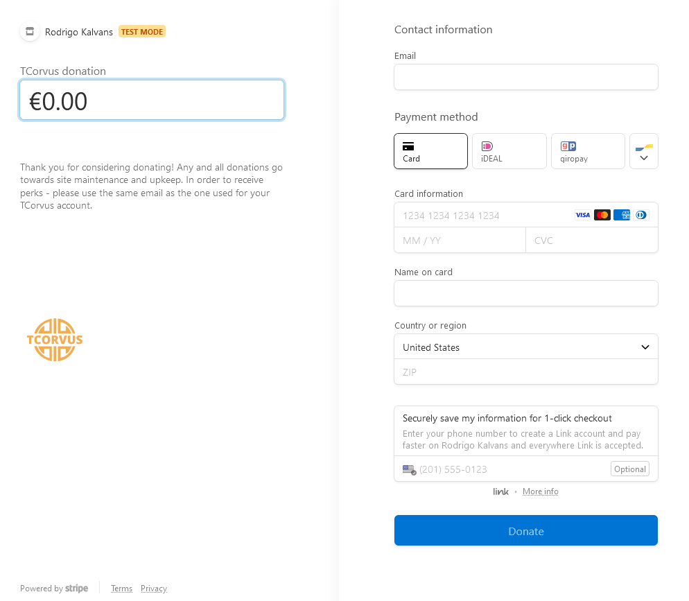

# Stripe

Created by: Rodrigo Kalvans
Created time: May 9, 2023 11:45 AM
Last edited by: Rodrigo Kalvans
Last edited time: May 30, 2023 2:47 PM

1. Sign in to your Stripe account
2. Follow the steps at the top of your dashboard to activate your account ([https://dashboard.stripe.com/test/dashboard](https://dashboard.stripe.com/test/dashboard)) (Your account will be in ‘test’ mode until it is activated)
3. Create a payment link here: ([https://dashboard.stripe.com/test/payment-links/create](https://dashboard.stripe.com/test/payment-links/create))
    1. Customers choose what to pay
    2. Title
    3. Description
    4. (Only email is needed from the user)
    5. (Include a note to the user that the email they enter must match that of their TCorvus account)
4. If you are doing this after handoff, save the payment link and add it as an environment variable by the name `PAYMENT_LINK`. If we are still in the development phase, share the link with us
5. Additionally, save your `PUBLISHABLE_KEY` and `SECRET_KEY`. Both can be found on the right side of your dashboard. These also need to be added to the project as environment variables. Just like with the payment link, if we are past handoff, add them to the project yourselves, if not, please provide us with both keys

Example result: 

